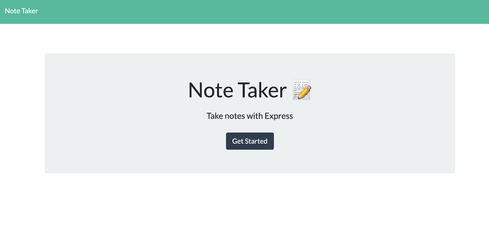
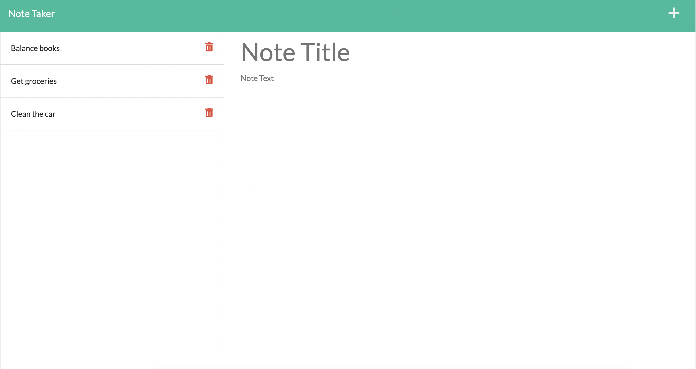
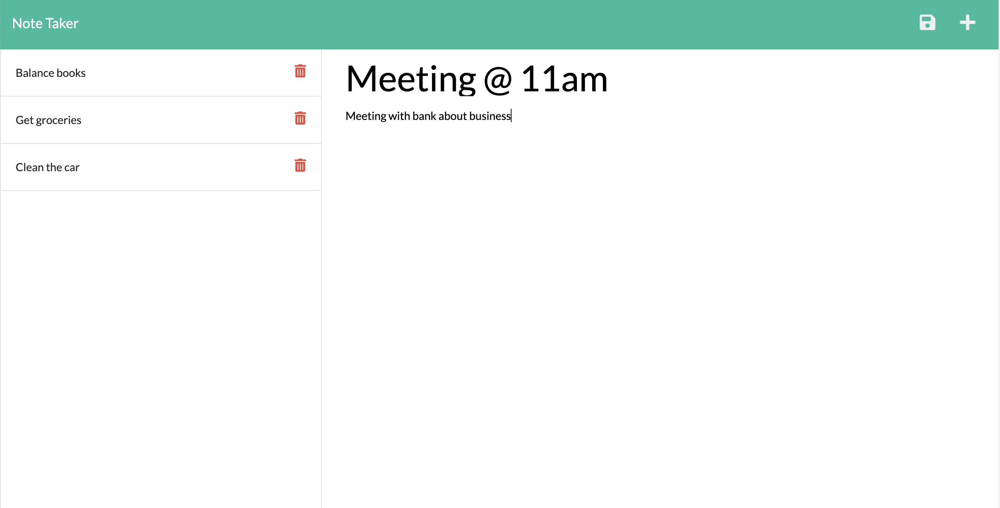
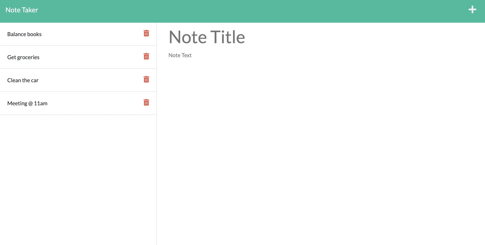
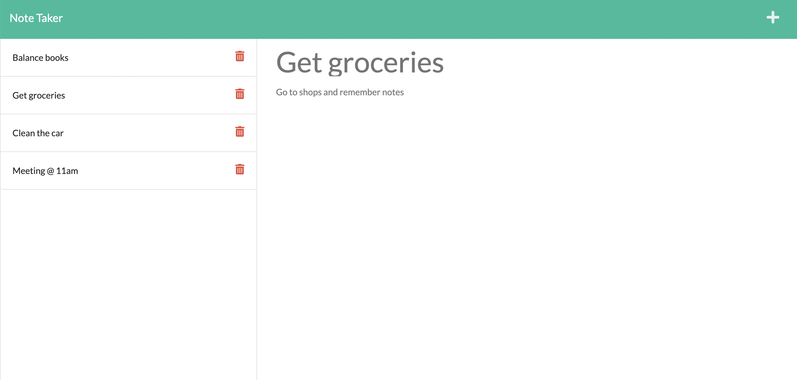
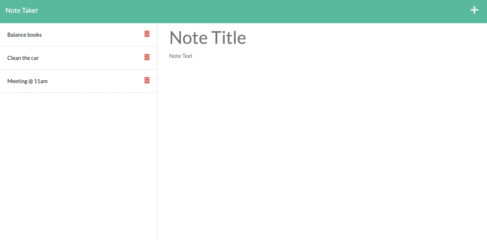

# Note Taker

## Description

This application is to be used to write and save notes using express js and APIs in the back end and to connect it to a front end using different routes.

Notes can be added and saved - they are saved to a JSON file in the repo. From here the notes are given unique ids and are stored until deleted.

## Installation

This application depends on express js and node js which will need to be installed. Once this has been done the repo can be cloned/forked to be ran.

## Usage

This project is to create notes and save them. Once the page is loaded you will see a home screen as shown below:
.

If the button is pressed you will be redirected to another page where you will be able to add notes, delete notes and view saved notes. As can be seen here there currently is not a save icon available in the top right as no note has been entered yet.

To add a new note click on Note Title to add the title and then Note Text to add the text, once both have been added the save button appears.

Once saved the note is added to the left hand side with other saved notes. These are not saved to local storage but are saved to a JSON database file in the back end. Notes will remain until deleted and can be viewed by clicking on a note to move it to the right hand part of the screen.

If the save button is pressed this will save the note and if the + button is pressed a new note are will appear to add a new note.

If the delete button is pressed then this will delete the note from the saved notes list

## Link

Please use this [link](https://whispering-mountain-13465.herokuapp.com/) to go to the deployed application on heroku.

## Questions

If there are any questions regarding this project please contact me through my the contact details on my GitHub profile - [DanLawrence91](https://github.com/DanLawrence91)
